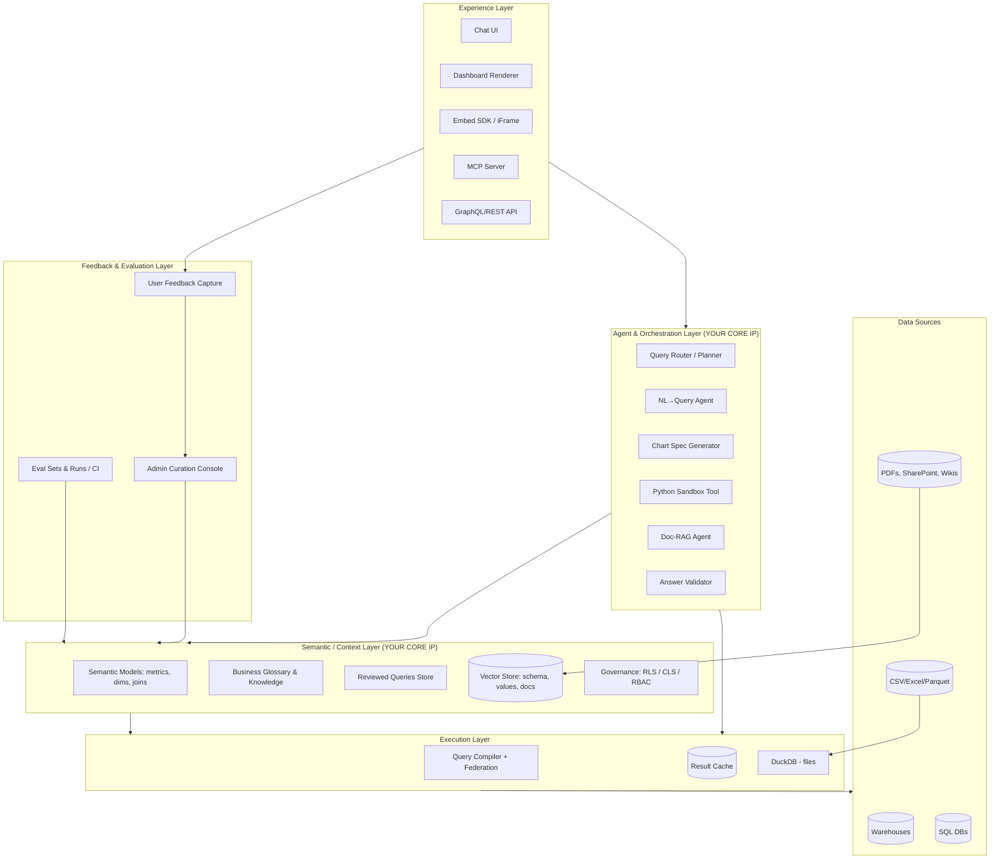
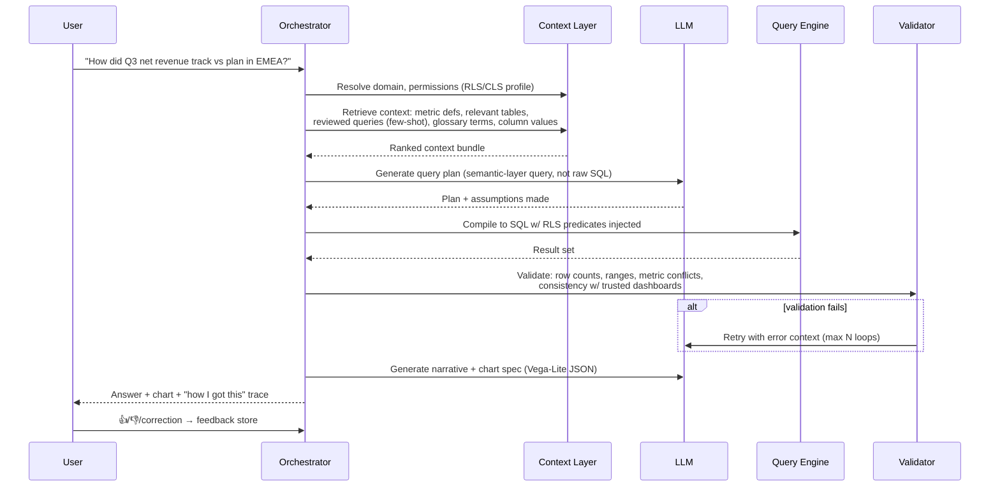

# Conversational Analytics Platform — Architecture & Build Approach

**Target:** Multi-tenant commercial SaaS, WisdomAI/Olive Labs class
**Scope:** Conversational BI, dynamic dashboards, semantic layer over databases/warehouses/files + unstructured data
**Strategy:** Assemble from open source; build the differentiating context/agent layer yourself
**Date:** 2026-07-08 · Author: Claude (for Shailesh)

---

## 1. Executive Summary

The core insight from studying WisdomAI: **accuracy is the product, and accuracy comes from governed business context — not from the LLM.** Raw text-to-SQL against enterprise schemas achieves roughly 40% accuracy in industry evaluations; the same LLMs over a well-modeled semantic layer approach 95–100%. WisdomAI's entire positioning ("Adaptive Context Engine") is built on this.

Therefore the build priority is inverted from what most teams assume:

| What teams assume matters most | What actually matters most |
|---|---|
| Chat UI, chart rendering | Semantic/context layer quality |
| LLM choice | Validation, evaluation, and feedback loops |
| Number of connectors | Query-time governance (RLS/CLS in the data layer) |
| Dashboard designer | Context lifecycle tooling (the admin experience) |

Your defensible IP is the **context engine + evaluation loop + multi-tenant governance**. Everything else (connectors, query engines, charting, vector search) should be assembled from proven open source.

---

## 2. Analysis of Reference Platforms

### 2.1 WisdomAI (from public docs, verified 2026-07-08)

Their documented architecture pipeline:

1. **Connected data sources** — Snowflake, BigQuery, Redshift, Databricks, PostgreSQL, SQL Server; SharePoint and file uploads for unstructured; MCP servers as sources.
2. **Semantic modeling ("Domains")** — admins document tables/columns, define relationships (1:N, N:M), metrics, and domain-specific knowledge. Data organized into business domains (Sales, Marketing…).
3. **NLQ engine** — parses questions, translates to SQL using the semantic model.
4. **Answer generation + dashboard builder** — answers become interactive dashboards that auto-refresh.
5. **Delivery layer** — email subscriptions, Slack, embedding (iFrame, React SDK, GraphQL API), their own MCP server.
6. **Feedback loop** — user corrections, "Reviewed Queries" (approved question→SQL pairs), negative-feedback monitoring.
7. **Knowledge review loop** — admins fold feedback back into the semantic layer.

Key mechanisms visible in their docs that you should replicate:

| Mechanism | What it does | Why it matters |
|---|---|---|
| **Domains** | Scoped bundle of data sources + context + permissions | Keeps context small and relevant per LLM call; natural tenancy/authz boundary |
| **Reviewed Queries** | Curated question→SQL pairs, admin-approved | Few-shot retrieval corpus; the single biggest accuracy lever |
| **Evaluation Sets & Runs** | Regression test suites for answer accuracy | Turns "accuracy" into an engineering metric you can CI |
| **Context checks at answer time** | Metric resolution, permission check, conflict detection, answer validation against expected ranges | Their "95% accuracy" claim rests on this multi-step validation, not one-shot SQL generation |
| **RLS/CLS enforced at query time in the data layer** | Row/column security compiled into every generated query | Non-negotiable for embedded/multi-tenant; app-layer filtering is a security hole |
| **RAG on textual columns** | Vector index on high-cardinality text columns | Solves the "WHERE status = ?" value-matching problem |
| **Python interpreter tool** | Sandboxed post-SQL analysis (forecasting, stats) | Handles questions SQL can't answer |
| **Agents (visual + prompt mode)** | Scheduled/triggered analytical workflows with human review | The "proactive" tier beyond Q&A |
| **Domain Health / Knowledge Playground** | Tooling to test and monitor context quality | Context is a lifecycle, not a one-time modeling project |

### 2.2 Olive Labs

Positioning: "Agentic Decision Intelligence" — *proactive* signal detection rather than question-answering. Continuously scans internal + external data, surfaces anomalies/drivers, explains causes, models next actions. Explicitly "no dashboards." Public technical documentation is thin; treat as directional signal, not verified architecture.

**Takeaway:** two product philosophies on one shared foundation —
- **WisdomAI**: pull model (user asks → governed answer) + dashboards
- **Olive**: push model (system watches → surfaces insight)

Build the pull model first; the push model (scheduled agents, anomaly detection) is a later phase reusing the same semantic layer and query stack.

---

## 3. Reference Architecture

### 3.1 System overview

### 3.2 Answer-generation flow (the accuracy engine)

Design rules embedded in this flow:

1. **LLM emits a semantic-layer query, not raw SQL.** The deterministic compiler produces SQL. This is the single biggest accuracy/safety decision — the LLM chooses *which* governed metric/dimensions, the compiler guarantees *correct joins, aggregations, and security predicates*.
2. **RLS/CLS injected at compile time, never by the LLM.** The LLM must never see or produce security predicates.
3. **Escape hatch:** questions outside the modeled surface fall back to constrained raw-SQL generation against a read-only, statement-timeout, row-limited connection — clearly labeled "unverified" in the UI. This mirrors how the market handles semantic-layer coverage gaps.
4. **Every answer carries provenance:** the compiled SQL, the metric definitions used, the context items retrieved, and validation results. Explainability is a trust feature and a debugging tool.
5. **Bounded self-correction:** validator failures feed back to the LLM with the error, max 2–3 retries, then honest failure ("I couldn't answer this reliably") — never a confident wrong answer.

### 3.3 Dashboards as declarative specs

Dashboards must be **data, not code**: a JSON document of widgets, each widget = `{semantic_query, viz_spec (Vega-Lite), layout, filters}`.

Consequences:
- "Turn this answer into a dashboard widget" = persist the query+spec the chat already produced. Chat and dashboards share one engine (WisdomAI's "one accuracy engine behind all surfaces").
- Auto-refresh = re-run the semantic query; no stale extracts.
- "Chat with a dashboard" = inject the dashboard's widget specs as context.
- Dashboard-level filters compile into every widget's semantic query.
- Embedding = render the same spec in an iFrame/React SDK with a scoped, short-lived token.

### 3.4 Unstructured data path

Separate pipeline, unified at the orchestrator:

1. **Ingest:** connectors (SharePoint, uploads, wikis) → extraction (text, tables, layout) → chunking → embedding → vector store, with tenant + ACL metadata on every chunk.
2. **Query time:** router classifies the question — structured (semantic layer), unstructured (RAG), or hybrid ("what does our pricing policy say, and how did discounting actually trend?"). Hybrid answers compose both tools in one agent loop.
3. **Governance parity:** document ACLs enforced at retrieval time, same as RLS for rows. A user must never retrieve chunks from documents they can't open.

Also use RAG *inside* the structured path: embed distinct values of high-cardinality text columns so "deals in the northeast region" resolves to `region = 'NE-US'` (WisdomAI does exactly this).

---

## 4. Component Selection (open-source assembly)

| Layer | Recommendation | Alternatives considered | Rationale |
|---|---|---|---|
| Semantic layer | **Cube Core (self-hosted)** | dbt MetricFlow; build your own | Cube is headless, multi-tenant aware, exposes SQL/REST/GraphQL + MCP, has query-time security context, caching/pre-aggregations. MetricFlow (Apache 2.0) is metrics-spec-first and worth adopting as a *definition format* (OSI standard direction), but dbt SL assumes a dbt-centric workflow you can't impose on SaaS customers. Building your own is justified only if Cube's model becomes a ceiling — defer. |
| NL→SQL reference | **Study WrenAI (AGPL — do not embed) + Vanna (MIT)** | — | WrenAI validates the semantic-model-first architecture (their MDL ≈ what you need); Vanna validates the RAG-over-examples approach. Combine both patterns in your own agent. Check licenses before any code reuse: AGPL contaminates SaaS. |
| File analytics | **DuckDB** | Pandas, Polars | In-process SQL over CSV/Excel/Parquet; lets uploaded files join the same semantic-query path with near-zero infra. |
| Vector store | **pgvector (start), dedicated engine later if scale demands** | Qdrant, Weaviate, Pinecone | One less system; tenant isolation via schema/RLS; migrate when >~50M vectors or latency demands it. |
| Charting | **Vega-Lite for LLM-generated specs; ECharts for polished dashboard rendering** | Highcharts (commercial) | Vega-Lite is declarative JSON — ideal LLM target, easy to validate against schema. |
| Orchestration | **Thin custom agent loop on provider SDKs; MCP for tool interfaces** | LangChain/LlamaIndex | Your agent loop is core IP and is not complex (router → retrieve → generate → compile → validate). Heavy frameworks add abstraction debt where you most need control. Use MCP so your tools are reusable by external agents (BYO-agent surface, like WisdomAI). |
| LLM strategy | **Provider-agnostic gateway; BYO-LLM per tenant** | Single provider | Enterprise buyers demand model choice/VPC deployment. Route: cheap fast model for routing/classification; frontier model for query planning; mid-tier for narrative. |
| Python sandbox | **gVisor/Firecracker-isolated containers, no network, per-execution** | Jupyter kernels | Untrusted LLM-generated code on customer data demands hard isolation. |
| App backend | **Postgres (metadata, RLS for tenancy), Redis (cache/queues), object storage (files)** | — | Boring, proven. |
| API | **GraphQL for embed/partner API; WebSocket/SSE for streaming answers** | REST-only | Matches embedding use cases (WisdomAI ships GraphQL); streaming is table stakes for chat UX. |

**Licensing caution (requires your validation before commitment):** verify current licenses of every component at adoption time — WrenAI is AGPL-family, Cube Core is Apache 2.0 with commercial features in Cube Cloud. Have counsel review anything embedded in a commercial SaaS.

---

## 5. Multi-Tenant SaaS Design Decisions

| Concern | Decision | Notes |
|---|---|---|
| Tenant isolation | Postgres RLS on all metadata tables + per-tenant encryption keys for stored credentials; per-tenant vector namespaces | Row-level tenancy is fine to start; offer schema/DB-level isolation as an enterprise tier |
| Customer data movement | **Query in place — never copy customer warehouse data into your platform** | Your only stored artifacts: metadata, context, embeddings, cached results (with TTL + per-tenant purge). This is a sales requirement ("data stays in place") as much as an engineering one |
| Credentials | Vault/KMS-backed secret storage; support key-pair auth, OAuth, and VPC peering/PrivateLink for warehouses | Static passwords in a SaaS DB is an instant enterprise disqualifier |
| End-user identity | Your RBAC + user attributes flow into RLS predicates at query compile time; SSO (SAML/OIDC), SCIM provisioning | WisdomAI's embed story leans on impersonation tokens + attribute-driven RLS — copy that |
| Embedding auth | Short-lived signed tokens minted by customer backend, scoped to user + domain | Never expose tenant API keys to browsers |
| Audit | Immutable log of every question, compiled SQL, data touched, and answer | Compliance requirement and your accuracy-debugging goldmine |
| Compliance runway | Design for SOC 2 Type II from day one (audit logs, access reviews, change management) | Certification takes 6–12 months of evidence; start early |

---

## 6. Phased Delivery Plan

**Phase 0 — Foundations (≈4–6 weeks)**
Tenancy model, auth (SSO-ready), connector framework (Postgres + Snowflake or BigQuery first), metadata store, secret management, audit logging skeleton. No AI yet. *Exit: a tenant can connect a source and browse schema securely.*

**Phase 1 — Semantic layer + governed Q&A MVP (≈8–10 weeks)**
Deploy Cube Core; build context-authoring UI (document tables/columns, define metrics/joins, glossary); agent loop v1 (router → retrieval → semantic query → compile → validate); chat UI with streaming, provenance display, and feedback capture; Vega-Lite chart generation; column-value RAG. *Exit: 50-question eval set per pilot tenant scoring ≥85% on modeled questions.*

**Phase 2 — Dashboards + files (≈6–8 weeks)**
Declarative dashboard spec, "answer → widget" flow, dashboard renderer, filters, sharing/ACLs, scheduled refresh + subscriptions; CSV/Excel upload via DuckDB into the same query path. *Exit: pilot users self-serve dashboards from chat.*

**Phase 3 — Unstructured + hybrid (≈8 weeks)**
Doc ingestion pipeline (uploads + SharePoint), ACL-aware retrieval, hybrid router, cited document answers. *Exit: hybrid questions answered with citations, ACLs enforced, measured on eval sets.*

**Phase 4 — Embed, agents, proactive (ongoing)**
Embed SDK (iFrame → React), GraphQL partner API, your MCP server; scheduled analytics agents with human review; anomaly detection / proactive signals (the Olive Labs tier); Python sandbox tool; white-labeling.

**Cross-cutting from Phase 1 onward — Evaluation CI:** every tenant gets eval sets (curated Q→expected-answer pairs); every change to context, prompts, or models runs the suite; accuracy is a tracked, per-domain metric. This is the discipline that separates a demo from a product.

Timelines assume a senior team of ~4–6 engineers and are estimates, not commitments — validate against your actual team.

---

## 7. Risk Register

| # | Risk | Likelihood | Impact | Mitigation |
|---|---|---|---|---|
| 1 | Accuracy below trust threshold → users abandon after first wrong answer | High | Critical | Semantic-layer-first generation; validation loop; honest refusals; eval CI; scope pilots to well-modeled domains |
| 2 | Context authoring burden — customers won't invest modeling effort ("the real challenge is semantic model production") | High | High | LLM-assisted bootstrap: auto-draft table/column docs, metric candidates, and joins from schema + query logs; admin approves rather than authors |
| 3 | Security breach via generated SQL (injection, cross-tenant leak) | Medium | Critical | LLM never writes raw SQL on the governed path; compile-time RLS; read-only creds; statement timeouts; row limits; per-tenant connection isolation; pen test before GA |
| 4 | LLM cost per query erodes SaaS margin | Medium | High | Model tiering; aggressive semantic-query result caching; reviewed-query cache hits skip generation entirely |
| 5 | Warehouse query costs land on customers unexpectedly | Medium | Medium | Cost estimation pre-execution, per-domain budgets, pre-aggregations in Cube |
| 6 | OSS licensing (AGPL) contamination | Medium | High | License audit gate in dependency review; legal signoff |
| 7 | Incumbent competition (Snowflake Cortex Analyst, Databricks Genie, ThoughtSpot) | High | High | Differentiate on cross-source federation + unstructured/hybrid + embeddability — platform-native AI only works when everything lives in one platform; most enterprises are messier |
| 8 | Hallucinated narrative on top of correct data | Medium | High | Narrative generation constrained to computed result set; validator checks numbers in prose against query output |
| 9 | Scale: large schemas (10k+ tables) blow context windows | Medium | Medium | Domain scoping; retrieval-ranked schema subset; never send full schema to the LLM |

---

## 8. Facts, Assumptions, Recommendations (explicitly separated)

**Facts (verified against sources, 2026-07-08):** WisdomAI's documented pipeline, mechanisms, and enterprise features as described in §2.1; MetricFlow is Apache 2.0; Wren Engine merged into WrenAI repo (May 2026); Vanna 2.0 is MIT; industry-reported accuracy deltas between raw text-to-SQL (~40% on enterprise schemas) and semantic-layer approaches (95–100% on modeled queries) — the specific numbers are vendor/benchmark-reported and should be treated as directional.

**Assumptions (material — flag if wrong):** team of ~4–6 senior engineers; initial customers are mid-market/enterprise with existing warehouses; you control the LLM budget via API providers (no on-prem model hosting in v1); English-first NLQ.

**Recommendations:** everything in §3–§6.

**Requires validation before build:** Cube Core's fit for per-tenant dynamic model loading at your scale; current licenses of all OSS at adoption time; pgvector performance at your projected embedding volume; actual accuracy numbers on *your* pilot tenants' schemas (run your own benchmark — do not trust vendor claims).

---

## 9. Sources

- [WisdomAI homepage](https://www.wisdom.ai/) · [How WisdomAI Works](https://docs.wisdom.ai/getting-started/how-wisdom-ai-works.md) · [WisdomAI docs index](https://docs.wisdom.ai/llms.txt)
- [Olive Labs](https://olivelabs.ai/)
- [Semantic layer vs text-to-SQL 2026 benchmark — dbt blog](https://docs.getdbt.com/blog/semantic-layer-vs-text-to-sql-2026) · [Why semantic layers make enterprise text-to-SQL safer](https://datalakehousehub.com/blog/2026-05-semantic-layers-text-to-sql/) · [arXiv: Semantic layers for reliable LLM analytics](https://arxiv.org/pdf/2604.25149)
- [Cube: semantic layer for AI agents 2026](https://cube.dev/articles/semantic-layer-for-ai-agents-2026) · [dbt Labs: open-source MetricFlow](https://www.getdbt.com/blog/open-source-metricflow-governed-metrics) · [dbt SL vs Cube](https://unwinddata.com/dbt-semantic-layer-vs-cube)
- [Dissecting open-source NL2SQL: Vanna, WrenAI, DB-GPT](https://sudiptapathak.com/blog/dissecting-open-source-nl2sql/) · [WrenAI GitHub](https://github.com/Canner/WrenAI) · [WrenAI vs Vanna enterprise guide](https://www.getwren.ai/post/wren-ai-vs-vanna-the-enterprise-guide-to-choosing-a-text-to-sql-solution)
- [Text-to-SQL tools comparison 2026 — Promethium](https://promethium.ai/guides/text-to-sql-comparison-2026-enterprise-solutions/) · [Top 10 semantic layer tools 2026](https://promethium.ai/guides/top-10-semantic-layer-tools-2026-definitive-comparison/)
